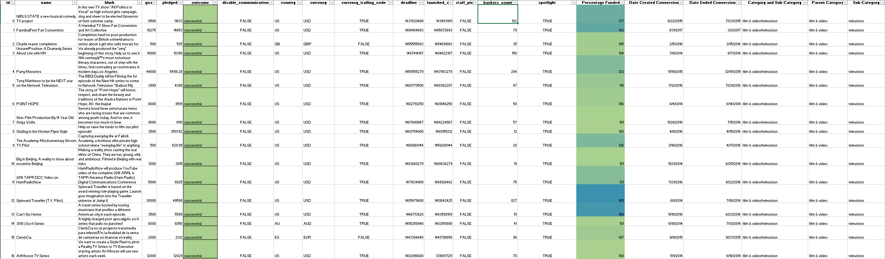

# KickStarter Analysis

## Background

Over two billion dollars have been raised using the massively successful crowdfunding service, Kickstarter, but not every project has found success. Of the over 300,000 projects aunched on Kickstarter, only a third have made it through the funding process with a positive outcome.

Since getting funded on Kickstarter requires meeting or exceeding the project's initial goal, many organizations spend months looking through past projects in an attempt to discover some trick to finding success. 

## Objective
### Organize and analyze a database of four thousand past projects in order to uncover any hidden trends. 
(Picture of the database is shown below)

## Analysis Process
* Used <b>conditional formatting</b> to fill each cell in the `state` column with a different color, depending on whether the associated campaign was "successful," "failed," "cancelled," or is currently "live".
* Created a new column at column O called `percent funded` that uses a formula to uncover how much money a campaign made towards reaching its initial goal.  
* Used <b>conditional formatting</b> to fill each cell in the `percent funded` column using a three-color scale. The scale should start at 0 and be a dark shade of red, transitioning to green at 100, and then moving towards blue at 200.
* Created a new column at column P called `average donation` that uses a formula to uncover how much each backer for the project paid on average.
* Created two new columns, one called `category` at Q and another called `sub-category` at R, which use formulas to split the `Category and Sub-Category` column into two parts. See picture below.

* Created a new sheet with a pivot table that will analyze the initial worksheet to count how many campaigns were "successful," "failed," "cancelled," or are currently "live" per **category**.
* Created a stacked column pivot chart that can be filtered by `country` based on the created table. See picture below.

* Created a new sheet with a pivot table that will analyze the initial sheet to count how many campaigns were "successful," "failed," "cancelled," or are currently "live" per **sub-category**.
* Created a stacked column pivot chart that can be filtered by `country` and `parent-category` based on the table that was created.
* Converted the dates stored within the `deadline` and `launched_at` columns from unix timestamps into a normal date.
* Created a new column named `Date Created Conversion` that converts the data contained within `launched_at` into Excel's Date format
* Created a new column named `Date Ended Conversion` that convertd the data contained within `deadline` into Excel's Date format

* Created a new sheet with a pivot table with a column of `state`, rows of `Date Created Conversion`, values based on the count of `state`, and filters based on `parent category` and `Years`.
* Created a pivot chart line graph that visualizes the above table.
* Created a new sheet with 8 columns: `Goal`, `Number Successful`, `Number Failed`, `Number Canceled`, `Total Projects`, `Percentage Successful`, `Percentage Failed`, and `Percentage Canceled`

  * In the `goal` column, created twelve rows with the following headers...
    * Less Than 1000
    * 1000 to 4999
    * 5000 to 9999
    * 10000 to 14999
    * 15000 to 19999
    * 20000 to 24999
    * 25000 to 29999
    * 30000 to 34999
    * 35000 to 39999
    * 40000 to 44999
    * 45000 to 49999
    * Greater than or equal to 50000
  * Utilized the `COUNTIFS()` formula to count how many successful, failed, and canceled projects were created with goals within those ranges listed above. Populated the `Number Successful`, `Number Failed`, and `Number Canceled` columns with this data.
  * Added up each of the values in the `Number Successful`, `Number Failed`, and `Number Canceled` columns to populate the `Total Projects` column. Then found the percentage of projects which were successful, failed, or were canceled per goal range.
  * Created a line chart which graphs the relationship between a goal's amount and its chances at success, failure, or cancellation.

## Findings

 1. The bulk of the sucessful KickStarter campaings lie within the $0 - $100,000 initial goal range. Thus, you are more likely to suceed with lower initial goals than higher ones.
 2. Generally speaking, the visualization confirms that the higher the cost of the initial goal, the more backers taht are required to successfully fun the campaign.

- - -

