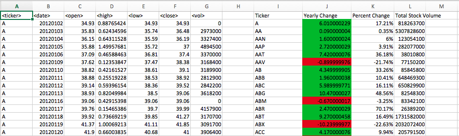

# Stock Market Analysis - VBA Scripting

### Objective:

Use VBA scripting to analyze real stock market data. 

### Analysis Process

* Created a script that loops through all the stocks and takes the following info...

   * Yearly change from what the stock opened the year at to what the closing price was.

   * The percent change from the what it opened the year at to what it closed.

   * The total Volume of the stock

   * Ticker symbol

* Used conditional formatting to highlight positive change in green and negative change in red. See the picture below.

* Created a function to gather the stock with the "Greatest % increase", "Greatest % Decrease" and "Greatest total volume". See picture below.

